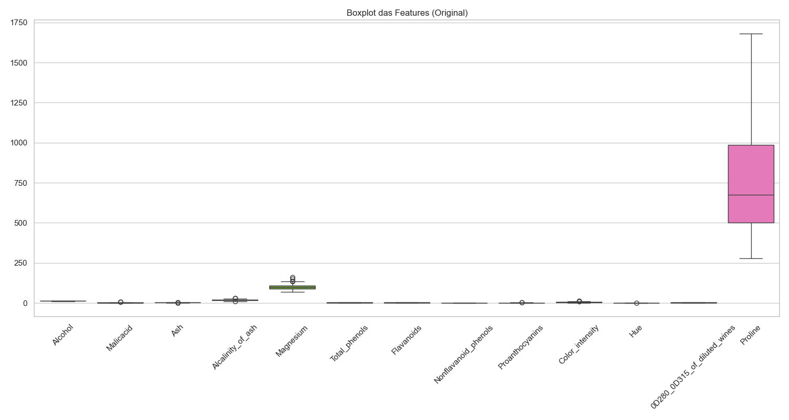
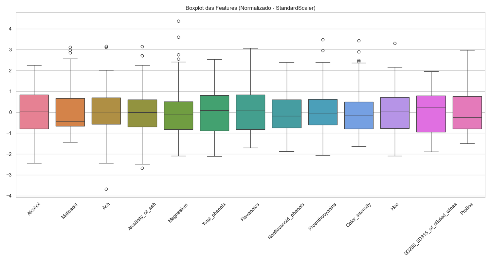
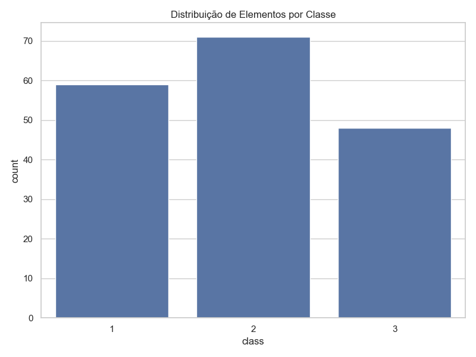
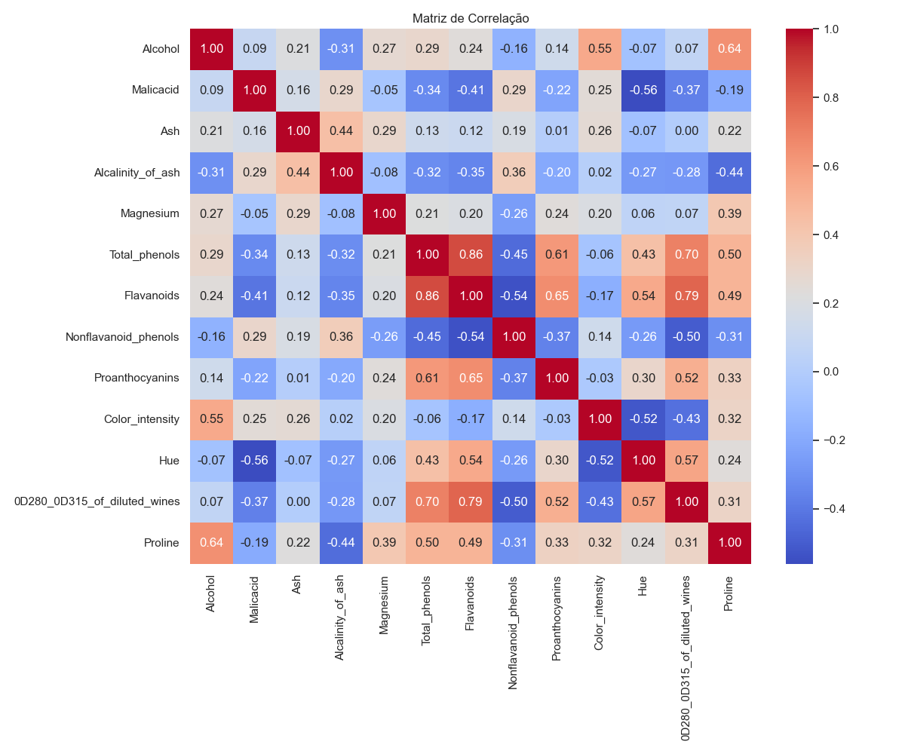
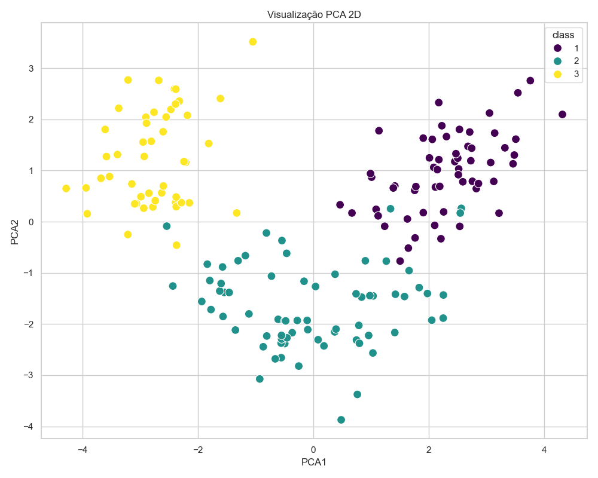

# Exercício de Pré-processamento de Dados - Dataset Wine

Este projeto realiza o pré-processamento e análise exploratória do dataset **Wine**, conforme solicitado na Atividade 12.

**Autor:** Guilherme Ramos  
**Ambiente:** Arch Linux (Python venv)

## 📋 Pré-requisitos

Para rodar o projeto, é necessário ter o Python instalado. As dependências estão listadas abaixo:
- `pandas`
- `matplotlib`
- `seaborn`
- `scikit-learn`
- `ucimlrepo`

## 🚀 Como Executar

1. Crie e ative o ambiente virtual:
   ```bash
   python -m venv venv
   source venv/bin/activate
   ```
2. Instale as dependências:
   ```bash
   pip install pandas matplotlib seaborn scikit-learn ucimlrepo
   ```
3. Execute o script:
   ```bash
   python guilherme_ramos_aula12.py
   ```

---

## 📊 Análises Realizadas

### a) Boxplot Original e Outliers
O primeiro boxplot mostra os dados em sua escala original. Observa-se que a feature `Proline` possui valores muito superiores às outras, o que achata a visualização das demais variáveis. Outliers são visíveis em variáveis como `Malicacid` e `Magnesium`.



### b) Normalização (StandardScaler)
Foi aplicada a técnica de **Z-score normalization** (StandardScaler), que centraliza a média em 0 e define o desvio padrão como 1. Isso permite comparar todas as features na mesma escala e identificar outliers de forma justa em todo o dataset.



### c) Distribuição de Classes
O gráfico de barras abaixo mostra a quantidade de amostras para cada uma das 3 classes de vinho no dataset.



### d) Matriz de Correlação
A matriz de correlação identifica como as features se relacionam entre si.
- **Maior Correlação:** `Flavanoids` e `Total_phenols` (0.86), indicando uma forte relação linear positiva.
- **Outra Correlação Forte:** `Flavanoids` e `OD280/OD315 of diluted wines` (0.79).



### e) PCA 2D (Análise de Componentes Principais)
Reduzimos as 13 dimensões originais para apenas 2 componentes principais. O gráfico mostra que as classes são bem separáveis no espaço transformado, validando a eficácia do PCA para simplificar o dataset mantendo a informação de classe.



---
*Este projeto foi desenvolvido como parte da disciplina de Inteligência Artificial.*
